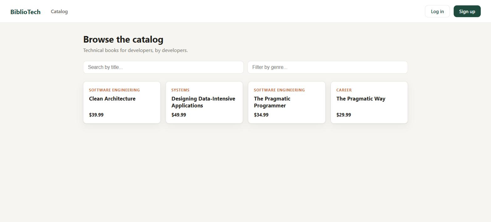
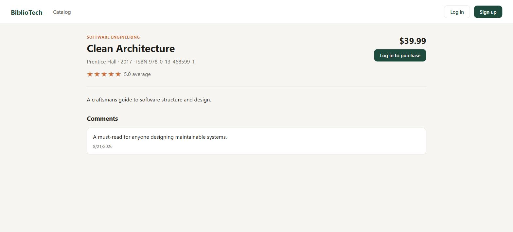

# BiblioTech

A full-stack bookstore application for technical books: a FastAPI + MySQL REST API and a
React + TypeScript frontend, with JWT authentication, catalog browsing, ratings/comments,
a shopping cart, and wishlists.

Originally built for **CEN 4010 – Software Engineering**, since hardened into a
production-shaped portfolio project: authenticated/authorized REST API, automated tests,
versioned database migrations, containerized local dev, and CI.




---

## Features

- **Catalog** — browse/search books by title and genre, paginated; top sellers; filter by
  minimum rating; per-publisher discounts (admin).
- **Auth** — registration, JWT login (OAuth2 password flow), bcrypt-hashed passwords, and
  role-based access (regular users vs. admins who manage the catalog).
- **Ratings & comments** — one rating per user per book (create-or-update), threaded
  comments, computed average rating.
- **Shopping cart** — per-user cart with quantity aggregation and live subtotal.
- **Wishlists** — up to 3 named wishlists per user, each holding any number of books.
- **Authorization** — every endpoint that touches a user's data (cart, wishlist, profile,
  ratings, comments) verifies the request is authenticated as that user; catalog mutations
  are admin-only.

---

## Architecture

**Backend** — FastAPI, SQLAlchemy 2.0, MySQL, Alembic migrations, JWT auth (`python-jose` +
`passlib`), pytest.

```text
app/
├── main.py              # FastAPI app, CORS, router registration
├── database.py           # engine/session setup
├── core/
│   └── security.py       # password hashing, JWT encode/decode
├── api/
│   ├── deps.py            # get_db, get_current_user, get_current_admin_user
│   └── routers/           # HTTP layer — request/response handling only
├── services/               # business logic + DB queries
├── models/                  # SQLAlchemy ORM models
└── schemas/                  # Pydantic request/response models
alembic/                        # versioned schema migrations
tests/                            # pytest suite (SQLite, isolated per test)
```

The routers are a thin HTTP layer; business logic and query construction live in
`services/`, which keeps the routers testable and the ORM usage in one place per domain.

**Frontend** — React 19, TypeScript, Vite, React Router. A small typed `api/` client
wraps `fetch`, attaches the JWT from `localStorage`, and normalizes API errors; an
`AuthContext` exposes `login`/`register`/`logout`/`user` to the rest of the app.

```text
frontend/src/
├── api/            # typed fetch client + one module per resource
├── context/         # AuthContext (JWT + current user)
├── components/        # NavBar, BookCard, StarRating, ProtectedRoute
└── pages/               # Catalog, book detail, cart, wishlist, auth, profile
```

---

## Running locally

### Option A — Docker Compose (backend + MySQL)

```bash
cp .env.example .env   # edit SECRET_KEY at minimum
docker compose up --build
```

The API comes up on `http://localhost:8000` (migrations run automatically on container
start) and interactive docs are at `http://localhost:8000/docs`.

Then run the frontend separately (Vite's dev server isn't containerized so you get fast
HMR):

```bash
cd frontend
cp .env.example .env.local   # VITE_API_URL defaults to http://localhost:8000
npm install
npm run dev
```

Visit `http://localhost:5173`.

### Option B — Fully manual

Backend (requires a running MySQL instance):

```bash
python -m venv .venv
.venv/Scripts/activate        # .venv/bin/activate on macOS/Linux
pip install -r requirements.txt

cp .env.example .env          # set DB_* and SECRET_KEY
alembic upgrade head
uvicorn app.main:app --reload
```

Frontend:

```bash
cd frontend
npm install
npm run dev
```

### Creating an admin user

Catalog writes require `is_admin`: adding a book through the frontend's `/admin` page
(`POST /books/create-book`), plus `PATCH /books/discount` and `POST /authors/create-author`
via `/docs` (there's no in-app UI for those two yet).

There is deliberately no API endpoint for granting admin — it's a privileged action, so it
shouldn't be reachable from the running app at all. Register a normal user, then promote
them with the CLI script instead:

```bash
python scripts/make_admin.py yourusername
```

It runs against whatever database `DATABASE_URL`/`.env` currently points at, so the same
script works locally or against a deployed database (point `DATABASE_URL` at it
temporarily). Once flagged, log back in (or refresh if already logged in) and an **Admin**
link appears in the navbar.

---

## Tests

```bash
pytest
```

The suite runs against an isolated in-memory SQLite database (see `tests/conftest.py`) and
covers auth, authorization boundaries (cross-user access, admin-only routes), the catalog,
cart, wishlist, ratings, and comments — 27 tests, no external services required.

CI (`.github/workflows/ci.yml`) runs the test suite, validates that Alembic migrations
apply cleanly, and builds the frontend on every push/PR to `main`.

---

## Database migrations

Schema changes are managed with Alembic rather than `create_all`:

```bash
alembic revision --autogenerate -m "describe the change"
alembic upgrade head
```

---

## Security notes

A few deliberate choices worth calling out, since this project began as a course
assignment where they weren't the default:

- Passwords are bcrypt-hashed (`app/core/security.py`), never stored or returned in plain
  text.
- Credit card numbers are **never persisted in full** — only the last 4 digits are stored,
  matching how real payment UIs display saved cards.
- Every user-scoped endpoint checks that the authenticated user matches the resource
  owner (e.g. you cannot read or modify another user's cart, wishlist, or profile).
- Catalog-mutating endpoints require an admin account, separate from regular users.

---

## Tech stack

| Layer | Tools |
|---|---|
| API | FastAPI, Pydantic v2, Uvicorn |
| ORM / DB | SQLAlchemy 2.0, MySQL, Alembic |
| Auth | JWT (python-jose), bcrypt (passlib) |
| Testing | pytest, httpx, SQLite (test-only) |
| Frontend | React, TypeScript, Vite, React Router |
| Infra | Docker Compose, GitHub Actions |

---

## License

See [LICENSE](LICENSE).
